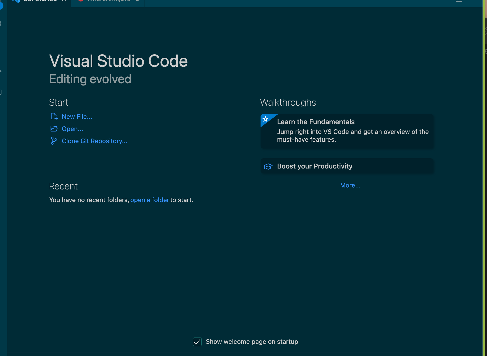
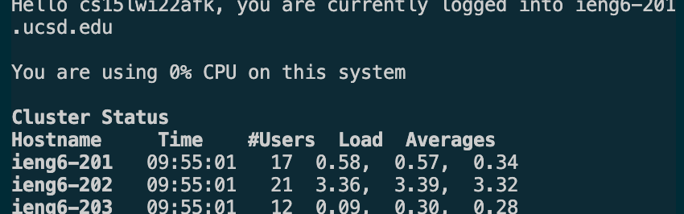

# Lab Report 1 - Logging into `ieng6` account
This is the first lab report for CSE15L. In this report I will document the steps for logging into your own `ieng6` account. 
## Installing VSCode studio
The first step is to download VSCode studio. After you have installed VSCode studio, you should see a window that looks like this. 
 

## Remotely connecting
Open the terminal on VSCode studio, and `ssh` into your own `ieng6` accoount with the command `ssh cs15lwi22afk@ieng6.ucsd.edu`. After that type in your password, and the terminal should have this output. 
 

## Running Commands
After that, we try running some commands on the terminal. Below are the list of commands we have ran and some of the outputs
- `cd` : change directory 
- `ls -lat` listing all files in the current directory
![image] 
