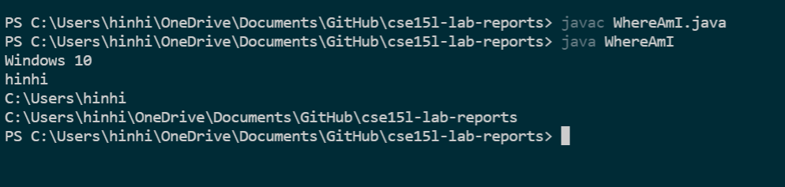

# Lab Report 1 - Logging into `ieng6` account
This is the first lab report for CSE15L. In this report I will document the steps for logging into your own `ieng6` account. 
## Installing VSCode studio
The first step is to download VSCode studio. After you have installed VSCode studio, you should see a window that looks like this. 
 

## Remotely connecting
Open the terminal on VSCode studio, and `ssh` into your own `ieng6` accoount with the command `ssh cs15lwi22afk@ieng6.ucsd.edu`. After that type in your password, and the terminal should have this output. 
 

## Running Commands
After that, we try running some commands on the terminal. Below are the list of commands we have ran and some of the outputs
- `cd` : change directory 
- `ls -lat` listing all files in the current directory

- `cat /home/linux/ieng6/cs15lwi22/public/hello.txt` 
 

## Moving Files with scp
Next we run WhereAmI.java on the local computer. Here's the result on the local computer

We now try to use tyhe `sch` command and move the files to the ieng computer.
`scp WhereAmI.java cs15lwi22afk@ieng6.ucsd.edu:~/`
The file is now copied to `ieng6` computers and when we list the files in the directory, we can see `WhereAmI.java`. We can also run it too as seen below. Notice the different output of the file path. 

 

## SSH Keys
For this task I generated a ssh key and I was able to ssh into `ieng6` without the need to log in. I first created an RSA key, and then by following the commands on the lab report I was ultimately able to ssh in to the server without a password.

 

## Optimizing Remote Running
Now that I have created a key to ssh to the server without a password. I can quickly copy files to the `ieng6` with just one command. And as you can see, I can copy `WhereAmI.java` to the server easily 
 

