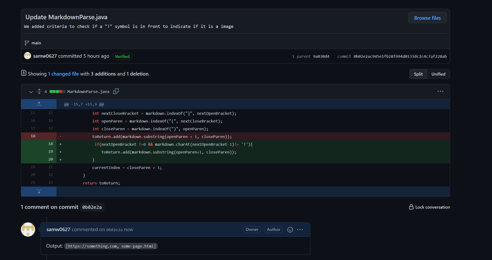
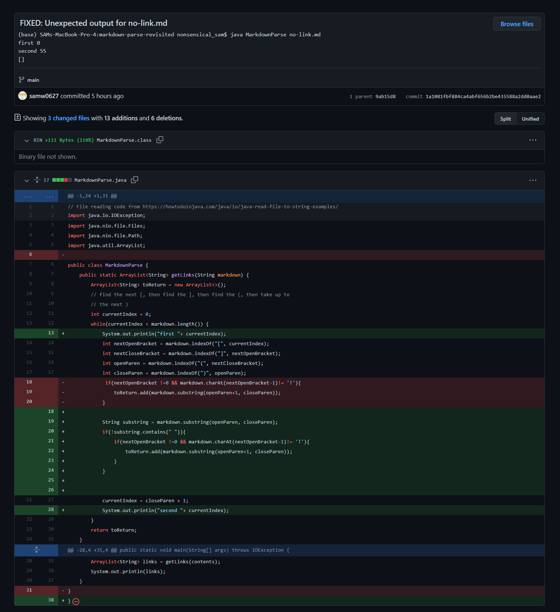
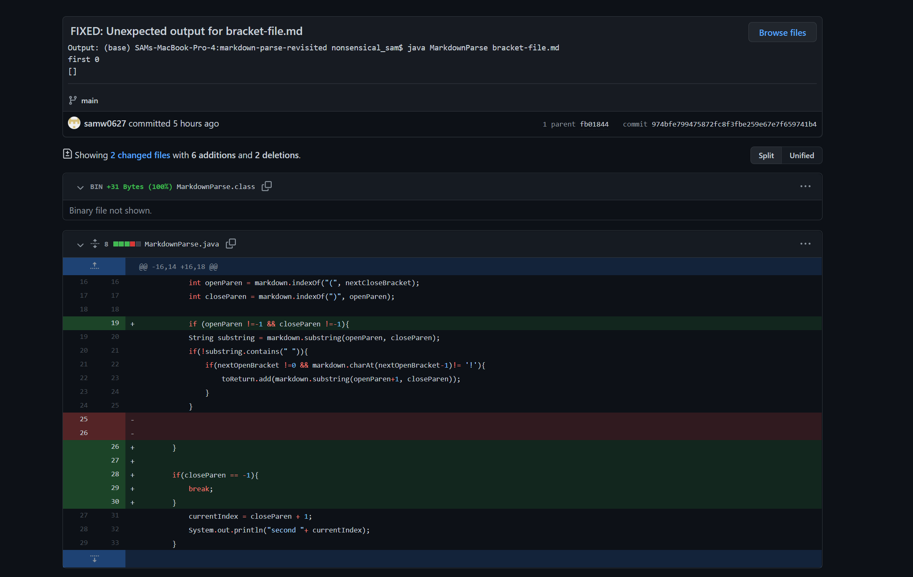

# Lab Report 2 - Debugging 
This lab report will detail the process of debugging the file MarkDownParse.java. The main goal of this program is to read and print only links in the markdown file.
## Fix 1: Testing the imagelink.md file
### (a) Symptom
[Here](https://github.com/samw0627/markdown-parse-revisited/blob/974bfe799475872fc8f3fbe259e67e7f659741b4/imagelink.md) is the link to the failure inducing input that prompted us to make the change.

When we tried to read from a program that has an image and a link. We ran the command 
`(base) SAMs-MacBook-Pro-4:markdown-parse-revisited nonsensical_sam$ javac MarkdownParse.java` 
`(base) SAMs-MacBook-Pro-4:markdown-parse-revisited nonsensical_sam$ java MarkdownParse imagelink.md`

and got the output. 
`[randomimage.png, https://something.com, https://something.com, some-page.html, some-page.html]` 

whereas the expected output should be 
`[https://something.com, some-page.html]`

The program printed out image file name as well as the links of the webpages.

### (b)What's The Problem?
The main bug is that the program failed to recognise that the brackets surrounding the image file is not a link. Therefore, when the program detects Square Brackets and Open Brackets on the same line, in this case `Fix

## Fix 2: Testing the nolink.md file
### (a) Symptom
[Here](https://github.com/samw0627/markdown-parse-revisited/blob/974bfe799475872fc8f3fbe259e67e7f659741b4/no-link.md) is the link to the failure inducing input that prompted us to make the change.

When we tried to read from a program that has no link inside of the brackets. We ran this command 
`(base) SAMs-MacBook-Pro-4:markdown-parse-revisited nonsensical_sam$ javac MarkdownParse.java` 
`(base) SAMs-MacBook-Pro-4:markdown-parse-revisited nonsensical_sam$ java MarkdownParse no-link.md`

and this was the  output. 
`[this is random text]` 

whereas the expected output should be 
`[]`

The program printed out the string inside of the brackets.

### (b)What's The Problem?
The main bug is that the program failed to recognise that a link has no space, hence it will print whatever is inside of the brackets, even if the string inside of the brackets is not a link, the program will still print out the link, leading to the symptom `[this is random text]` .

### (c)Fix

We added a condition to check if there is spcae inside of brackets, as links usually don't have space.

## Fix 3: Testing the bracket-file.md file
### (a) Symptom
[Here](https://github.com/samw0627/markdown-parse-revisited/blob/974bfe799475872fc8f3fbe259e67e7f659741b4/bracket-file.md) is the link to the failure inducing input that prompted us to make the change.

When we tried to read from a program that has an image and a link. This is the commaand that we typed in 
`(base) SAMs-MacBook-Pro-4:markdown-parse-revisited nonsensical_sam$ javac MarkdownParse.java` 
`(base) SAMs-MacBook-Pro-4:markdown-parse-revisited nonsensical_sam$ java MarkdownParse bracket-file.md`

the original output was an infinite loop. 

whereas the expected output should be

`[]`

### (b)What's The Problem?
The main bug is that the program failed account for the case where there is no bracket in the file, hence the index never increment. Therefore, it will not be able to get out of the while loop. 

### (c)Fix

