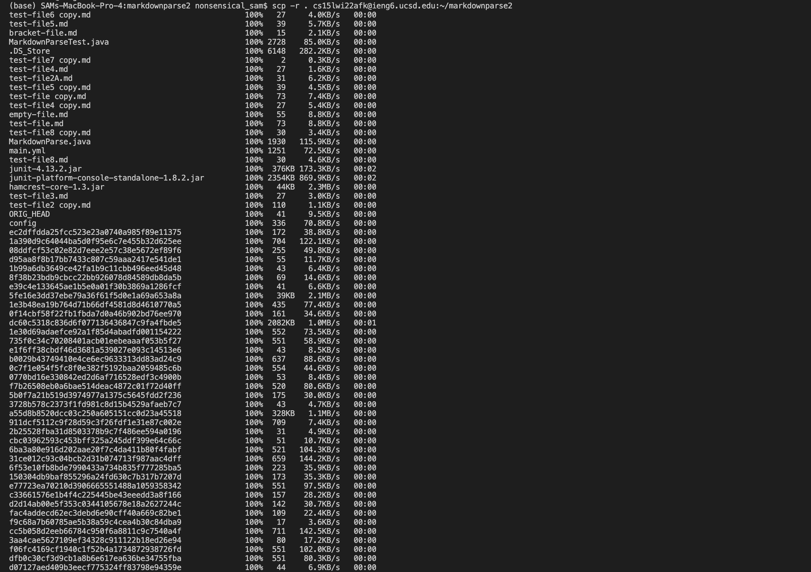
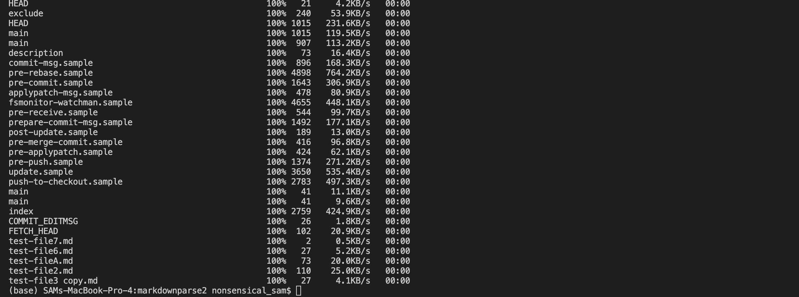
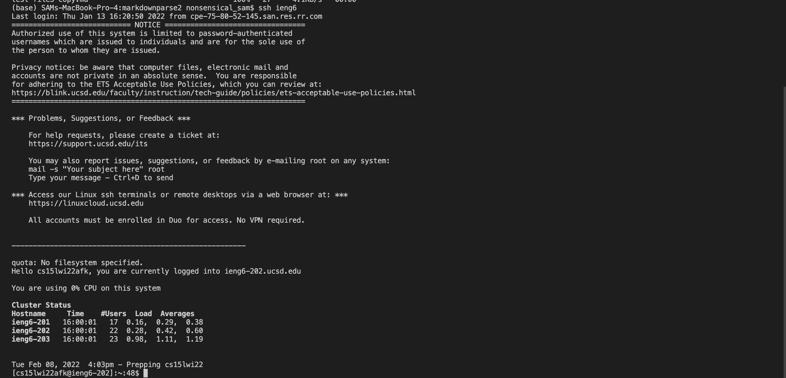
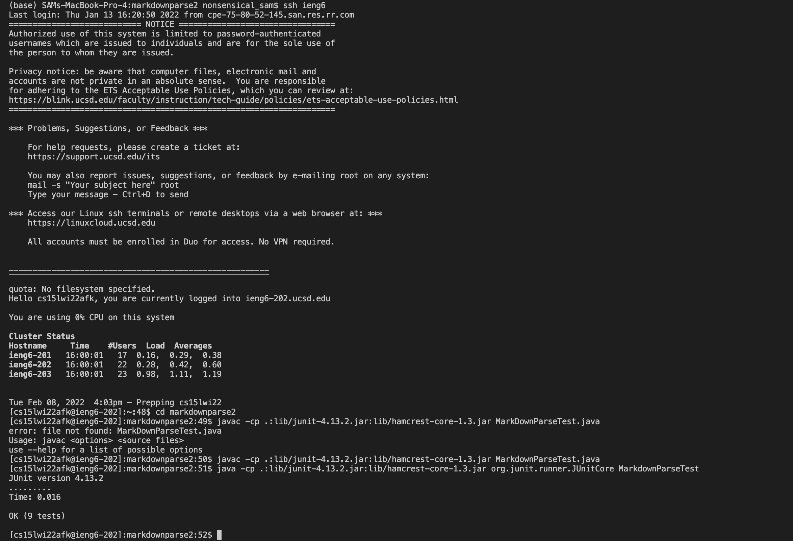

# Lab Report 3 - Copy whole directories with  `scp -r`
## Step 1: Copying markdownparse2 into ieng6 account
Using the command `$ scp -r . cs15lwi22afk@ieng6.ucsd.edu:~/markdownparse2` I was able to copy the whole markdownparse2 directory to ieng6

 
## Step 2: Compiling and running the tests after logging into ieng6
Next I log into ieng6 and tried to compile MarkdownparseTest using the commands 
`ssh ieng6` 
`cd markdownparse2` 
`javac -cp .:lib/junit-4.13.2.jar:lib/hamcrest-core-1.3.jar MarkdownParseTest.java` 
 `java -cp .:lib/junit-4.13.2.jar:lib/hamcrest-core-1.3.jar org.junit.runner.JUnitCore MarkdownParseTest` 
 The test passes!.

 
## Step3: Doing it all in one command
Finally, I tried completing all the above task by only using one command, which is the combaination of the above three commands. 
`scp -r . cs15lwi22afk@ieng6.ucsd.edu:~/markdownparse2; ssh ieng6 'cd markdownparse2; javac -cp .:lib/junit-4.13.2.jar:lib/hamcrest-core-1.3.jar MarkdownParseTest.java; java -cp .:lib/junit-4.13.2.jar:lib/hamcrest-core-1.3.jar org.junit.runner.JUnitCore MarkdownParseTest'`

